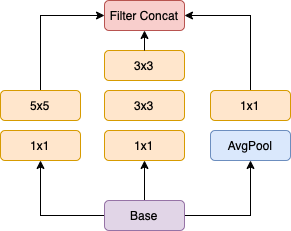
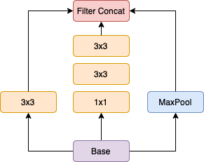
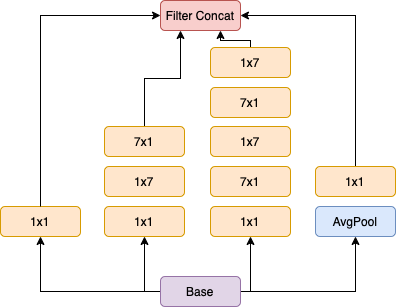
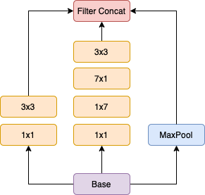
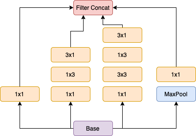
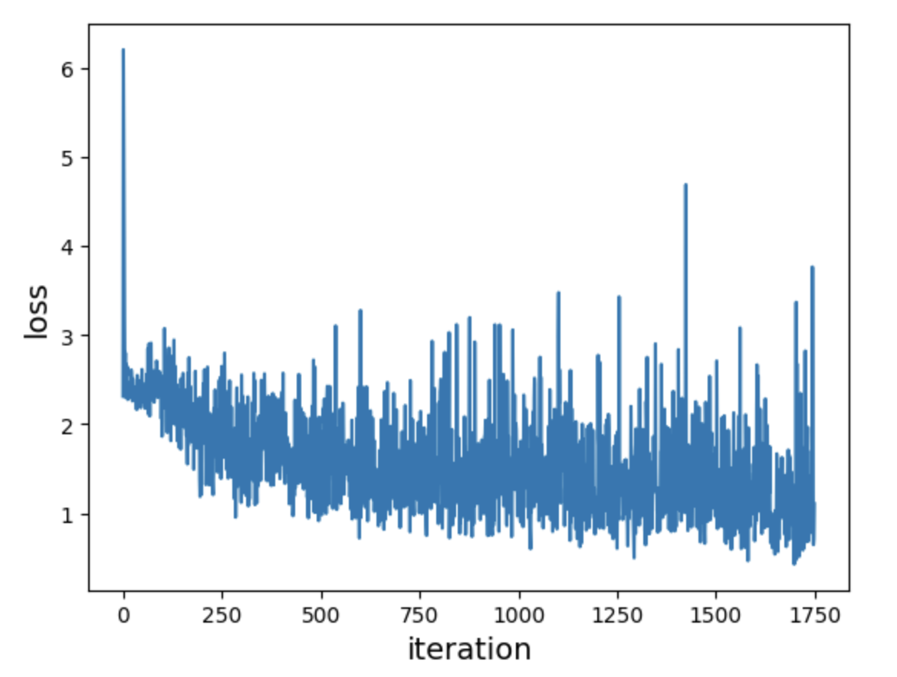
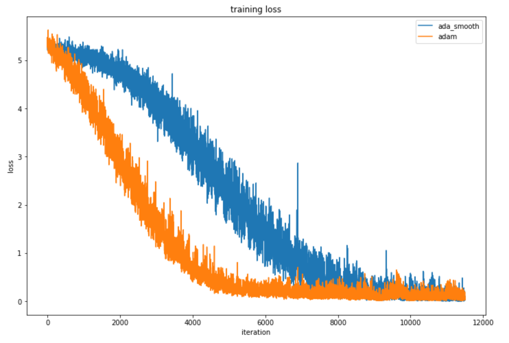
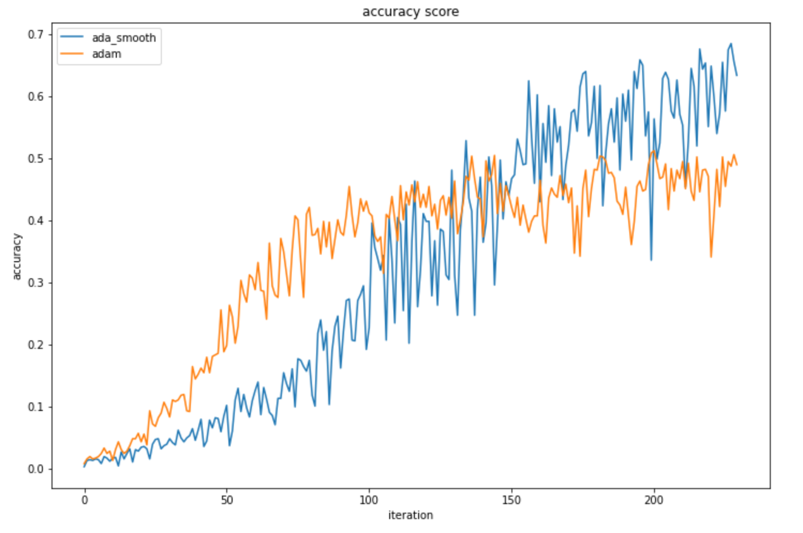

#### Table of content
* [Inception v3](#inceptionv3)
* [AdaSmooth](#adasmooth)
* [Experiments and results](#experiments)

## Inception v3

__arxiv:__ [https://arxiv.org/abs/1512.00567](https://arxiv.org/abs/1512.00567)

The advantages of the architecture are as follows:
* Getting rid of bottlenecks, that is, layers with a sharp decrease in dimension, especially early in the network.
* Wide layers learn faster.
* Neighboring pixels in the image are highly correlated with each other, so the dimensionality in front of the convolutional layer can be reduced without losing representational power.
* A proportional increase in the depth and width of the network is more efficient than an increase in depth alone.

The architecture consists of inception blocks of different types:
* __Inception A__

    Сonvolution 5x5 and two consecutive convolutions 3x3 have the same receptive field, so it is proposed to process the image in two ways and then concatenate.

    The pooling layer can be placed before or after the convolutions, in both cases the output dimension will be the same. But in the first case there will be a sharp decrease in the number of activations, and the second is inefficient from the point of view of calculations. Therefore, it is proposed to use a pooling layer parallel to two other branches and also concatenate.

    

* __Inception B__

    Here the scheme is similar to block Inception A. Convolutional layers with strides are used.

    

* __Inception C__

  Instead of convolution nxn, we can apply convolution nx1 and convolution 1xn. This makes the architecture computationally efficient. In this block, n is equal to 7.
  
  

* __Inception D__

  

* __Inception E__

  Same trick with convolutions 1xn and nx1, but n is 3.

  

The resulting model contains *24 388 980* trainable parameters.

#### Implementation

* Numpy: [numpy_modules](./numpy_modules)

* Torch: [torch_modules](./torch_modules) (based on the [implementation from the torch vision library](https://github.com/pytorch/vision/blob/main/torchvision/models/inception.py))

The numpy model was trained on a [mnist](http://yann.lecun.com/exdb/mnist/) dataset of 1750 steps with a batch size of 8.
From the plot, you can see that the model is training, the loss is falling.

## AdaSmooth

__arxiv:__ [https://arxiv.org/abs/2204.00825](https://arxiv.org/abs/2204.00825)

The main advantage of the approach is that it eliminates the need to sort through the hyperparameters by hand, except for the learning rate.

In addition, this method, unlike other optimizers, takes into account not only the absolute value of the gradients, but also the overall movement in each dimension.

#### Effective Ratio
This is obtained thanks to the coefficient *efficiency ratio* (ER), which is often used in the field of finance.

$$e_t=\frac{s_t}{n_t} = \frac{\text{Total move for a period}}{\text{Sum of absolute move for each bar}} = \frac{|x_t - x_{t - M}|}{\sum^{M - 1}_{i=0}{|x_{t - i} - x_{t - 1 - i}|}}$$

Or

where  –– the vector of values of all trainable model parameters at step 
and  –– step values vector of gradient descent at step .

A large value of this coefficient in the dimension of  means that in the space of parameters the gradient descent moves in a certain direction in this dimension, smaller values mean that the gradient descent moves in a zigzag pattern.

To simplify calculations,  is chosen equal to the batch index at each epoch. In this case, there is no need to store the  values of all parameters, but you can recalculate the value of EP in the accumulated fashion.

#### AdaSmooth

In the algorithm __AdaDelta__ (RMSProp), the delta step is calculated as follows:

where

,

The constant  is also known as the smoothing constant (SC) and can be written as

and the period  can be thought of as the number of past values to do the moving average calculation.

Let's take a small period value and a large period value . Taking values outside this range is inefficient.
Then, with a small value of the period, a small number of past steps are taken into account and gradient descent quickly moves in a new direction. With a large period value, gradient descent tends to move in the direction of the accumulated gradients and slowly changes direction in the new direction.

Let's denote

,

The value of the period is just determined by the behavior of gradient descent at each step, which is expressed by the coefficient ER.

The value of , in contrast to the __AdaDelta__ method, is calculated as follows:

The rest is calculated in the same way as in the __AdaDelta__ method.

#### Implementations
* Numpy: [ada_smooth.py](./ada_smooth.py)
* Torch: [torch_ada_smooth.py](./torch_ada_smooth.py)

## Experiments and results

Torch implementation of __Inception V3__ was trained with two optimizers on the cars dataset: __AdaSmooth__ and __Adam__.
The dataset contains 196 classes –– car brands.

The models were trained for _50_ epochs with a batch size of _128_. The learning rate for both optimizers is _1e-3_.
The implementation of adam is taken from the torch library, the beta parameters are equal _0.9_ and _0.999_.

The values of the loss function are shown in the plot below.

As you can see, the method __AdaSmooth__ converges more slowly than the __Adam__ method. But when training a model with an optimizer __AdaSmooth__, the accuracy on the validation set reaches higher values with the same number of steps (*0.685* vs *0.50625*):

Such results are obtained due to the features of the optimizer __AdaSmooth__. It adjusts the parameters depending on how gradient descent behaves. That is, he needs time to correctly adjust the coefficient ER. Therefore, the convergence of this method is slower.

Since the method takes into account not only the absolute values of the gradients, but also the overall shift in a certain direction. This more accurate information allows you to find more optimal parameters for the model, so the quality when using such an optimizer
